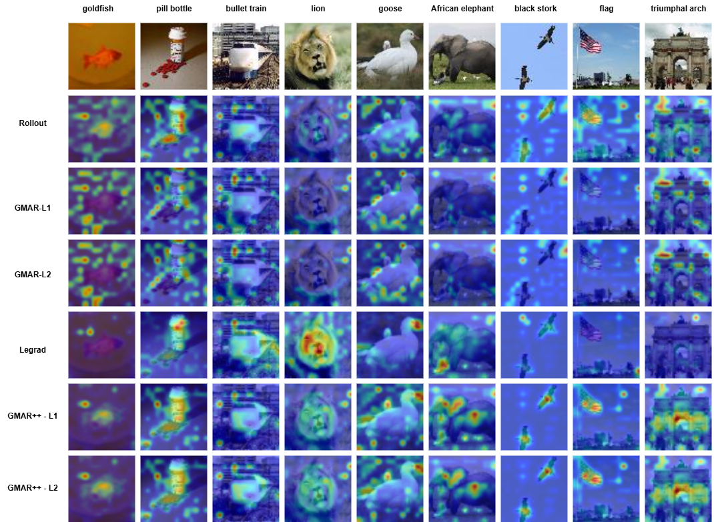

# GMAR++: Efficient Gradient-Enhanced Attention Rollout

<div align="center">


**A cutting-edge explainability framework for Vision Transformers using gradient-enhanced attention mechanisms**

[](https://www.python.org/)
[](https://pytorch.org/)

</div>

---

## 📋 Abstract

Interpreting Vision Transformers (ViTs) is challenging due to their reliance on multi-head self-attention and the absence of spatially localized representations. Existing attribution methods either trace attention flow or exploit gradients, but fail to jointly capture structural reasoning and spatial sensitivity. We propose GMAR++, a gradient-enhanced attention rollout method that integrates positive gradient filtering, attention–gradient interaction, and head-wise relevance weighting. GMAR++ unifies the structural interpretability of attention rollout with the spatial fidelity of gradient-based attribution, yielding sharper and more class-specific visual explanations. Experiments on Tiny-ImageNet with ViT-L/16 show that GMAR++ consistently outperforms Rollout, GMAR, and LeGrad, achieving lower Average Drop, higher Average Increase, and improved Insertion/Deletion Area Under the Curve. These results highlight the effectiveness and scalability of GMAR++ and its potential applicability to larger datasets and advanced transformer architectures

---

## 📊 Visual Results

### Example Explanations Across Methods

<div align="center">



</div>

*Above: Attention heatmaps generated by different methods (Rollout, GMAR-L1, GMAR-L2, LeGrad, GMAR++) for various object classes*

The visualization demonstrates:
- **Rollout**: Broad, diffuse attention patterns
- **GMAR-L1/L2**: Focused attention with gradient weighting
- **LeGrad**: Layer-wise gradient-based explanations
- **GMAR++**: Sharp, highly localized attribution maps

---

## 🚀 Quick Start

### Installation

#### macOS

```bash
# Clone the repository
git clone https://github.com/soham5498/GMAR-Plus-Efficient-Gradient-Enhanced-Attention-Rollout.git
cd "GMAR++"

# Create a Python virtual environment
python3 -m venv env
source env/bin/activate

# Upgrade pip
pip install --upgrade pip

# Install dependencies
pip install -r requirement.txt

# For M1/M2 Mac with GPU support (optional)
pip install torch torchvision torchaudio --index-url https://download.pytorch.org/whl/cpu
```

#### Linux (Ubuntu/Debian)

```bash
# Clone the repository
git clone https://github.com/soham5498/GMAR-Plus-Efficient-Gradient-Enhanced-Attention-Rollout.git
cd "GMAR++"

# Create a Python virtual environment
python3 -m venv env
source env/bin/activate

# Upgrade pip
pip install --upgrade pip

# Install dependencies
pip install -r requirement.txt

# For GPU support (CUDA 12.1)
pip install torch torchvision torchaudio --index-url https://download.pytorch.org/whl/cu121
```

#### Windows

```powershell
# Clone the repository
git clone https://github.com/soham5498/GMAR-Plus-Efficient-Gradient-Enhanced-Attention-Rollout.git
cd "GMAR++"

# Create a Python virtual environment
python -m venv env
env\Scripts\activate

# Upgrade pip
python -m pip install --upgrade pip

# Install dependencies
pip install -r requirement.txt

# For GPU support (CUDA 12.1)
pip install torch torchvision torchaudio --index-url https://download.pytorch.org/whl/cu121
```

### Basic Usage

```bash
# Run the main explainability analysis
python main.py

# Follow the interactive prompts:
# 1. Select an explainability method (rollout/gmar/legrad/gmar++)
# 2. Process images from the local dataset
# 3. Optionally download and process TinyImageNet validation set
```

**Example Interaction:**
```
Which method? (rollout/gmar/legrad/gmar++): gmar

Processing local images...
✓ Processed: goldfish.jpg
✓ Processed: lion.jpg
✓ Processed: african_elephant.jpg
...

Download TinyImageNet test set? (y/n): y
Processing TinyImageNet samples...
```
---

## 🛠️ Configuration

### Environment Variables

```bash
# GPU/CPU selection
export CUDA_VISIBLE_DEVICES=0  # Use GPU 0, or leave unset for CPU

# Model checkpoint location (optional)
export CHECKPOINT_PATH=./checkpoints/vit_large_tinyimagenet/best
```

### Hyperparameters

Edit `src/engine.py` to modify:
- **alpha** (0.0-2.0): Residual scaling factor for rollout
- **norm_type** ('l1' or 'l2'): Gradient normalization method
- **batch_size**: Number of images to process simultaneously
- **image_size**: Input resolution (default: 224×224)

---

## 🎓 Citation

If you use GMAR++ in your research, please cite:

```bibtex
@software{gmar_plus,
  title={GMAR++: Efficient Gradient-Enhanced Attention Rollout},
  author={Sohambhai Joita, Prof. Dr. phil. Tatyana Ivanovska},
  year={2025},
  url={https://github.com/soham5498/GMAR-Plus-Efficient-Gradient-Enhanced-Attention-Rollout}
}
```

---


